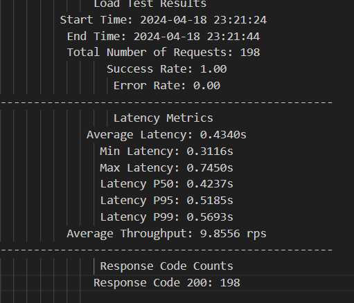
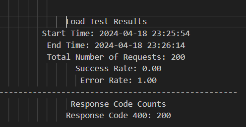
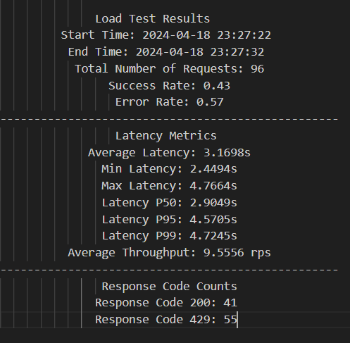
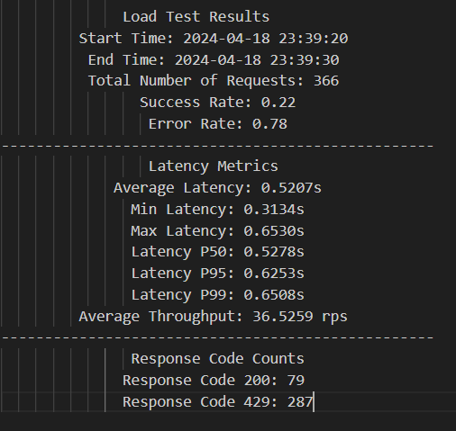

# Load Tester

This repository contains a load testing script that allows you to test the performance of a web service by sending a specified number of requests per second.

## Code

### Argparse Flags
The argparse flags used in the script are:
- `--qps`: Queries per second (QPS) for the load test. Defaults to 10
- `--url`: URL to send HTTP requests. **Required**
- `--duration`: Duration of the load test in seconds. Defaults to 30s
- `--concurrent`: Number of concurrent requests. Defaults to 1 worker

### Load Testing Behavior and Explanation
During the load testing process, you may observe certain behaviors or outcomes that are influenced by various factors. Below are explanations for common observations:

#### 1. Fluctuations in Achieved QPS
- **Reason**: The actual queries per second (QPS) achieved during the test may fluctuate due to asynchronous execution, network latency, and server response times.
- **Explanation**: Asynchronous requests and varying response times can impact the rate at which requests are processed, resulting in variations in the achieved QPS compared to the specified value (`--qps`).

#### 2. Latency Variations
- **Reason**: The observed latency for each request may vary based on network conditions, server load, and response times.
- **Explanation**: Network latency, server performance, and concurrency settings influence the latency of individual requests. The reported average latency (`Average Latency`) reflects the overall performance during the test duration.

#### 3. Partial Throughput & Partial QPS
- **Reason**: The observed partial throughput has a slightly different value compared to the QPS for the partial metrics
- **Explanation**: QPS involves sending in requests and hence uses `success `, `error` and `task queue` to compute. Since throughput only computes transaction completed we omit `task queue` as the queue holds pending jobs. 


## Docker

To build and run the Docker container:

1. Ensure you have Docker installed on your machine.
2. Navigate to the directory containing the Dockerfile.
3. Build and run the Docker image using the instructions below:

### Building the Docker Image

Run the following command

```docker build -t <Your-Image-Name> .```

This should build your docker image from Docker file by installing all the required dependencies

### Running the Docker Image

``` 
docker run -it <Your-Image-Name> \
--qps <qps-count> \
--duration <duration-sec> \
--url <Input-URL>
--concurrent <Requests-count>
 ```
 **Note** - Despite increasing or decreasing the number of concurrent workers the QPS remains unaffected as the interval utilizes ```(1 * concurrent_req) /qps``` to prolong the sleep


## Load Test Metrics

Upon ```docker run``` the cli displays partial metrics as the programs executes.
Once the program finishes executing full metrics are displayed on the CLI

### 1. Partial Metrics

The following partial metrics were collected during the load test:

| Metric               |
|----------------------|
| Elapsed Time         |
| QPS (Queries/s)      |
| Average Latency      | 
| Successful Requests (200 OK) |
| Errors               |
| Partial Throughput   |

**Explanation of Partial Metrics**

- **Elapsed Time**: The time elapsed since the start of the load test.
- **QPS (Queries/s)**: The calculated Queries Per Second (QPS) based on the current test interval.
- **Average Latency**: The average response latency for successful requests during this interval.
- **Successful Requests (200 OK)**: The number of requests that received a successful response (HTTP 200 OK).
- **Errors**: The number of requests that resulted in errors (non-200 status codes).
- **Partial Throughput**: The rate of successful requests processed per second during this interval.

### 2.Full Metrics

The following metrics are collected during the load test:

| Metric               |
|----------------------|
| Start Time           |
| End Time             |
| Total Number of Requests |
| Success Rate         | 
| Error Rate           |
| Average Latency      | 
| Min Latency          | 
| Max Latency          |
| Throughput           |
| P 50/95/99           | 
| Response Code Counts | 

**Explanation of Metrics**

- **Start Time**: The timestamp when the load test began.
- **End Time**: The timestamp when the load test concluded.
- **Total Number of Requests**: The total number of HTTP requests sent during the test.
- **Success Rate**: The percentage of requests that received successful responses (HTTP 200 OK).
- **Error Rate**: The percentage of requests that resulted in errors (non-200 status codes).
- **Average Latency**: The average response latency for all successful requests.
- **Min Latency**: The minimum response latency observed.
- **Max Latency**: The maximum response latency observed.
- **Throughput**: The rate of successful requests processed per second during the test.
- **P50/95/99**: Latency percenticle
- **ResponseCode Count**: Counts response codes for all the requests sent out


These metrics provide insights into the performance and reliability of the tested system under load conditions.


## Example Runs

1. Hitting a valid URl

```docker run -it load_tester --qps 10 --duration 20  --url http://youtube.com```




2. Hitting an invalid URl

```docker run -it load_tester --qps 10 --duration 20  --url http://helloworld.ca```





3. Hitting a unstable(Flaky) url

```docker run -it load_tester --qps 10 --duration 10  --url http://en.wikipe.org```



4. Hitting a valid URL with limits

```docker run -it load_tester --qps 40 --duration 10  --url https://www.linkedin.com --concurrent 1```


**Note** - Additionally the programs sets a timeout for 60 secs before cancelling the pending jobs


## Limitations
1. This rate of qps is dependent on  how fast  `aiohttp.ClientSession()` is capable of hitting the server. In this program given it's limitations/latency the program support max achievable qps upto a few 100's with enough concurrent workers


## Further Enhancement
1. The maximum QPS can be further improved from 100's to over 1000's by using more advanced http calling libraries such as pycurl
2. Simulate more than 1 client to sent multiple requests.
3. Build Dashboards to monitor QPS
